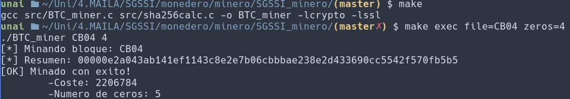

# SGSSI minero
En la asignatura SGSSI el resumen criptografico de cada trabajo que se entrega se almacena en un bloque. Cada bloque guarda los resumenes *sha256* de cada trabajo de cada alumno correspondientes a esa actividad. 
La estructura de un bloque es la siguiente:

* Numero de bloque
* Titulo de la tarea + numero de elementos
* identificador del bloque anterior
* resumenes sha256

El objetivo del minero en es conseguir que el resumen del ultimo bloque tenga la mayor cantidad de ceros al pricipio del resumen sha256 del bloque. Mediante este programa, se calculan resumenes dependiendo de los parametros que se le pongan al pricipio.

## Instrucciones de uso

**Para compilar el programa usa:**
      
      make
      
**Para ejecutarlo usa:**
      
      make exec file=CBXX zeros=N
      
A la variable *file* se le asigna el nombre del bloque y a la variable *zeros* el numero de ceros que se quiere como minimo.

**Para hacer clean ejecuta:**

      make clean

