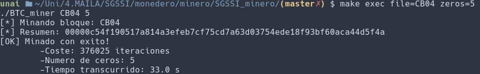

# SGSSI minero 
En la asignatura SGSSI el resumen criptográfico de cada trabajo que se entrega se almacena en un bloque. Cada bloque guarda los resúmenes *sha256* de cada trabajo de cada alumno correspondientes a esa actividad. 
La estructura de un bloque es la siguiente: 

* Número de bloque 
* Título de la tarea + número de elementos 
* identificador del bloque anterior 
* Resúmenes sha256 

El objetivo del minero en es conseguir que el resumen del último bloque tenga la mayor cantidad de ceros al principio del resumen sha256 del bloque. Mediante este programa, se calculan resúmenes dependiendo de los parámetros que se le pongan al principio. 

## Instrucciones de uso 

**Para compilar el programa usa:** 
    
    make 

**Para ejecutarlo usa:** 

    make exec file=CBXX zeros=N 

A la variable *file* se le asigna el nombre del bloque y a la variable *zeros* el número de ceros que se quiere como mínimo. 

**Para hacer clean ejecuta:** 
    
    make clean 

 

## Integridad de los archivos 

**BTC_miner.c:** c59056d49067bfbc1cc18eaf50ed581e 
**sha256calc.c:** 043d24299581d40972cd55ad8cb80705 
**sha256calc.h:** 69a9beeec2a125486a7f97765775a2d9
